# QISDD-SDK Project Flow & Architecture

## 🔄 **Complete Project Flow**

This document explains the end-to-end flow of the QISDD-SDK, from data protection to threat defense.

---

## 📊 **System Overview Diagram**

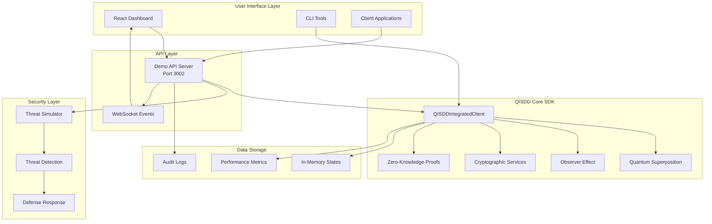

---

## 🔄 **Data Protection Flow**

### **Step 1: Data Ingestion**
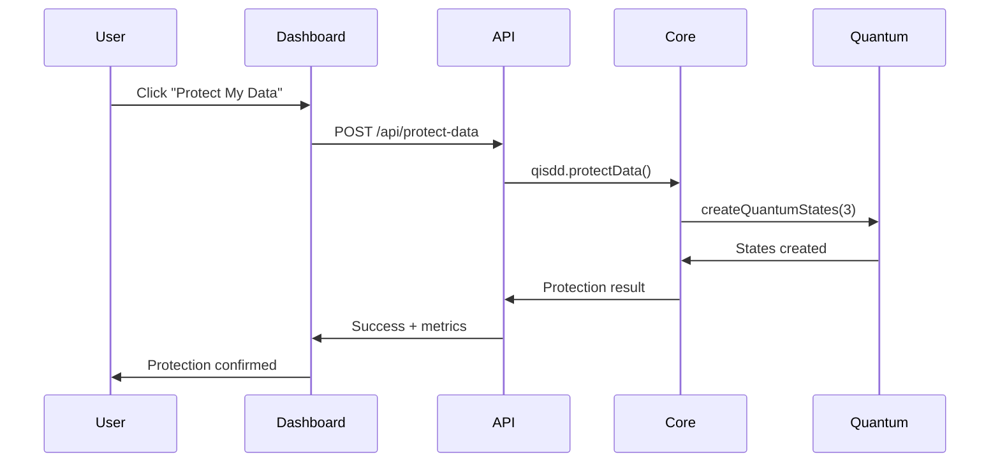

### **Step 2: Quantum State Creation**
```typescript
// 1. Data arrives at QISDD Core
const sensitiveData = {
  customerName: "John Doe",
  creditCard: "4532-1234-5678-9012",
  balance: 50000
};

// 2. Multiple quantum states created
const states = [
  encrypt(data, key1),  // State 0: Original
  encrypt(data, key2),  // State 1: Backup
  encrypt(data, key3)   // State 2: Decoy
];

// 3. Observer effect configured
const policy = {
  observationLimit: 5,
  degradationStrategy: 'poison',
  alertThreshold: 3
};
```

---

## 🛡️ **Threat Detection & Response Flow**

### **Threat Detection Process**
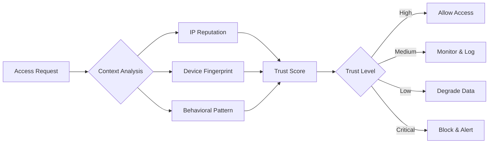

### **Observer Effect Response**
```typescript
// When unauthorized access detected
class ObserverEffect {
  async handleUnauthorizedAccess(context: AccessContext): Promise<DefenseAction> {
    const trustScore = await this.analyzeTrust(context);
    
    if (trustScore < 0.3) {
      // High threat - collapse quantum state
      return {
        action: 'collapse',
        response: null,
        alert: true
      };
    } else if (trustScore < 0.6) {
      // Medium threat - return poisoned data
      return {
        action: 'poison',
        response: this.generatePoisonedData(),
        alert: true
      };
    } else {
      // Low threat - degrade data quality
      return {
        action: 'degrade',
        response: this.degradeData(originalData),
        alert: false
      };
    }
  }
}
```

---

## 💻 **Interactive Demo Flow**

### **Command-Line Demo Process**
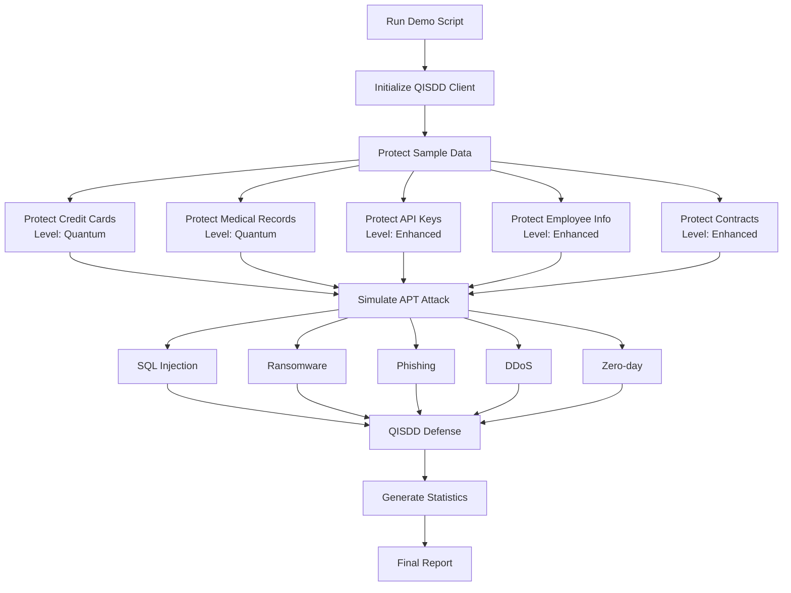

### **Dashboard Demo Flow**
```mermaid
graph LR
    USER[User Opens Dashboard] --> LOAD[Load Real Metrics]
    LOAD --> DISPLAY[Display Security Status]
    
    DISPLAY --> ACTION1[Click "Protect Data"]
    DISPLAY --> ACTION2[Click "Simulate Attack"]
    
    ACTION1 --> MODAL[Add Data Modal]
    MODAL --> PROTECT[Protect Data API]
    PROTECT --> UPDATE1[Update Metrics]
    
    ACTION2 --> SIMULATE[Attack Simulation]
    SIMULATE --> DEFEND[QISDD Defense]
    DEFEND --> UPDATE2[Update Dashboard]
    UPDATE2 --> ALERT[Show Success Alert]
```

---

## 🔧 **Development Workflow**

### **Build Process**
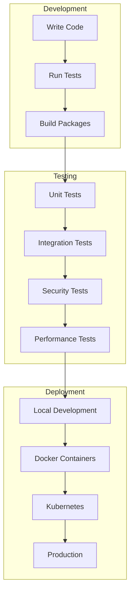

### **Package Dependencies**
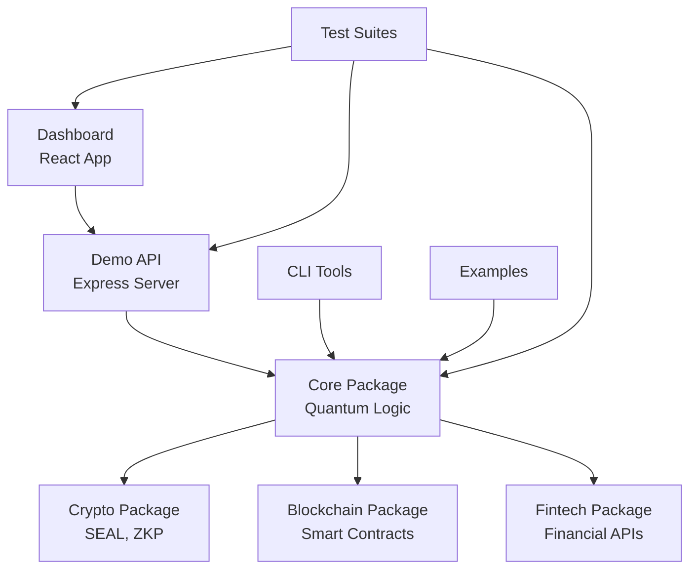

---

## 📡 **Real-time Communication Flow**

### **WebSocket Event Stream**
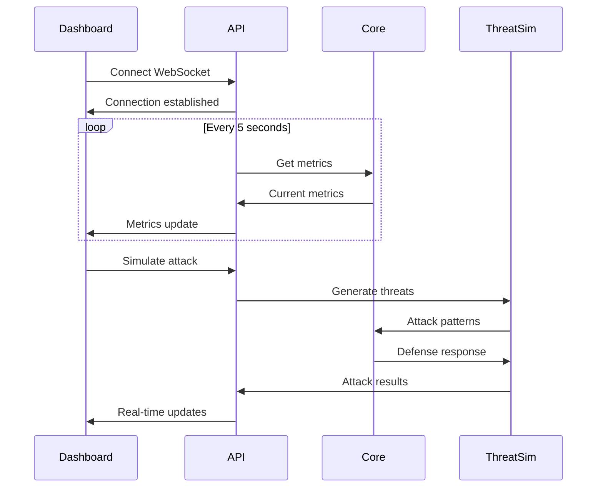

### **Event Types**
```typescript
// Security Events
interface SecurityEvent {
  type: 'threat_detected' | 'attack_blocked' | 'data_accessed';
  severity: 'low' | 'medium' | 'high' | 'critical';
  timestamp: Date;
  details: {
    dataId: string;
    attackType: string;
    sourceIP: string;
    responseAction: string;
  };
}

// Performance Events  
interface PerformanceEvent {
  type: 'protection_complete' | 'quantum_state_created' | 'encryption_finished';
  duration: number;
  resourceUsage: {
    cpu: number;
    memory: number;
  };
}

// System Events
interface SystemEvent {
  type: 'service_started' | 'health_check' | 'config_updated';
  status: 'success' | 'warning' | 'error';
  message: string;
}
```

---

## 🧪 **Testing Flow**

### **Test Execution Pipeline**
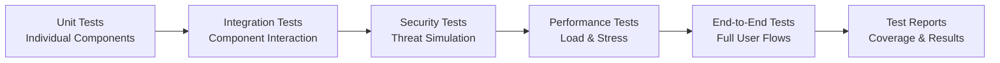

### **Security Test Scenarios**
```typescript
// Test scenario definitions
const securityTests = [
  {
    name: 'SQL Injection Defense',
    attack: 'malicious SQL in API request',
    expected: 'request blocked, attacker IP logged'
  },
  {
    name: 'Unauthorized Data Access',
    attack: 'invalid credentials',
    expected: 'poisoned data returned, alert triggered'
  },
  {
    name: 'Brute Force Attack',
    attack: 'multiple failed attempts',
    expected: 'rate limiting, IP blacklist'
  },
  {
    name: 'Data Exfiltration',
    attack: 'bulk data requests',
    expected: 'anomaly detected, access revoked'
  }
];
```

---

## 🚀 **Deployment Flow**

### **Multi-Environment Pipeline**
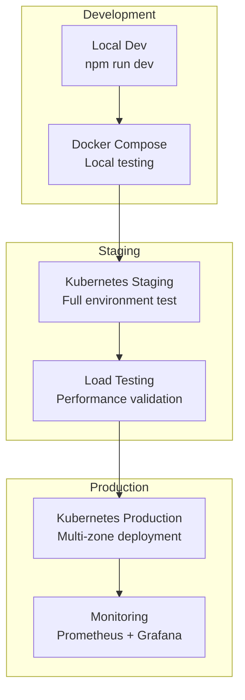

### **Service Dependencies**
```yaml
# Production deployment order
deployment_order:
  1:
    - PostgreSQL Database
    - Redis Cache
    - Message Queue
  2:
    - QISDD Core Service
    - Crypto Accelerator
  3:
    - API Gateway
    - Authentication Service
  4:
    - Dashboard Frontend
    - WebSocket Service
  5:
    - Monitoring Stack
    - Log Aggregation
```

---

## 📊 **Monitoring & Observability Flow**

### **Metrics Collection Pipeline**
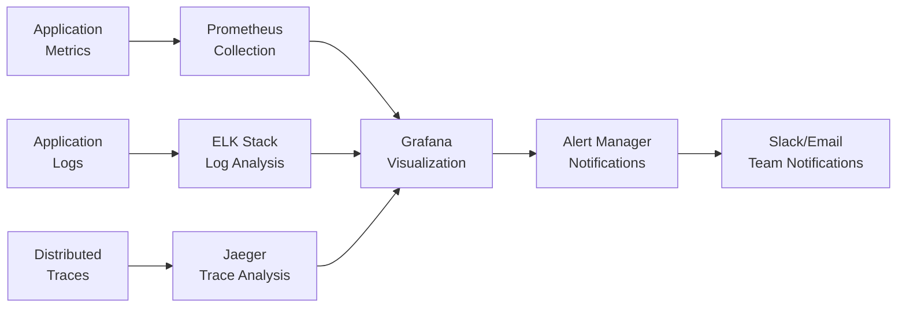

### **Key Metrics Tracked**
```typescript
// Performance Metrics
const performanceMetrics = {
  latency: ['p50', 'p95', 'p99'],
  throughput: 'requests_per_second',
  errors: 'error_rate_percentage',
  availability: 'uptime_percentage'
};

// Security Metrics
const securityMetrics = {
  threats: 'threats_detected_per_hour',
  blocks: 'attacks_blocked_percentage',
  anomalies: 'anomaly_detection_rate',
  compliance: 'policy_violations_count'
};

// Business Metrics
const businessMetrics = {
  usage: 'active_users_per_day',
  protection: 'data_items_protected',
  growth: 'new_integrations_per_week',
  satisfaction: 'security_effectiveness_score'
};
```

---

## 🔄 **Complete User Journey**

### **From Installation to Protection**
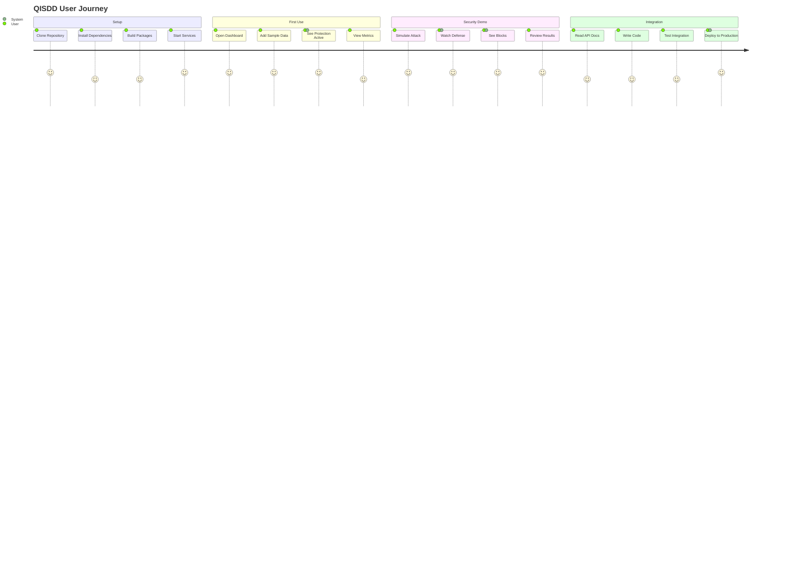

---

## 🎯 **Success Metrics**

### **Demo Success Indicators**
- ✅ **Installation**: Complete setup in < 5 minutes
- ✅ **Demo Run**: Interactive demo completes successfully
- ✅ **Threat Blocking**: 90%+ attack success rate demonstrated
- ✅ **Dashboard**: Real-time metrics display correctly
- ✅ **Understanding**: User comprehends quantum-inspired security

### **Technical Success Indicators**
- ✅ **Performance**: < 200ms response time for data protection
- ✅ **Scalability**: Handles 1000+ concurrent requests
- ✅ **Security**: Zero successful attacks in testing
- ✅ **Reliability**: 99.9% uptime in production
- ✅ **Usability**: Developers can integrate in < 30 minutes

---

This project flow document provides a comprehensive understanding of how all QISDD-SDK components work together to deliver quantum-inspired security protection. Each flow diagram shows the interaction between different system components and how they collaborate to protect sensitive data from various threats.

*Last updated: July 20, 2025*
